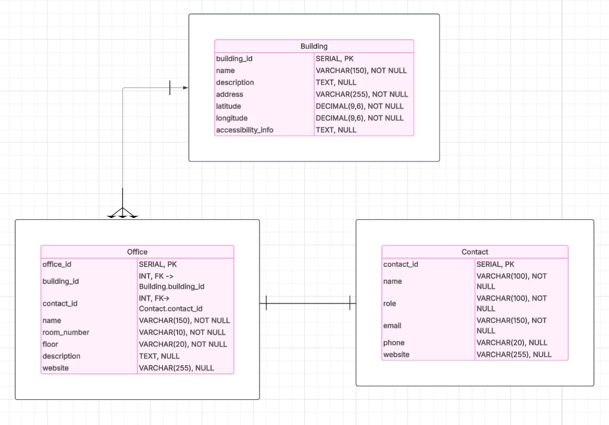

# berea-atlas

A campus building + office directory with a Python backend (Flask + Peewee + PostgreSQL) and a modern React frontend (Vite).

---

## 🧱 Architecture 

```
berea-atlas/
├─ backend/
│  ├─ database/
│  │  ├─ hydration/                    
│  │  │  ├─ hydrate_buildings.py
│  │  │  ├─ hydrate_contacts.py
│  │  │  └─ hydrate_offices.py
│  │  ├─ db_config.py                   
│  │  └─ init_db.py                     
│  ├─ models/
│  │  ├─ __init__.py                     
│  │  └─ models.py                      
│  ├─ logic/                             
│  ├─ pages/ & static/                   
│  └─ ... (Flask app entrypoint)
├─ src/                                  
├─ .env                                  
└─ README.md
```

### Database Schema

<p align="center">
  
</p>

---

## 🚀 Quick start (dev)

**Prereqs:** Python 3.10+

```bash
# 1) Create and activate a venv
python -m venv venv
source venv/bin/activate

# 2) Install backend deps
pip install -r requirements.txt  

# 3) Install frontend deps
npm install

# 4) Create a .env at repo root
cat > .env <<'EOF'
FLASK_ENV=development
FLASK_DEBUG=1
DB_HOST=localhost
DB_NAME=berea_atlas
DB_USER=<your_username>
DB_PASSWORD=<your_password>
DB_PORT=5432
EOF

# 5) Initialize DB schema 
python -m backend.database.init_db

# 6) Hydrate initial data
python -m backend.database.hydration.insert_data


# 7) Run backend 
flask run 

# 8) Run frontend
npm run dev
```

